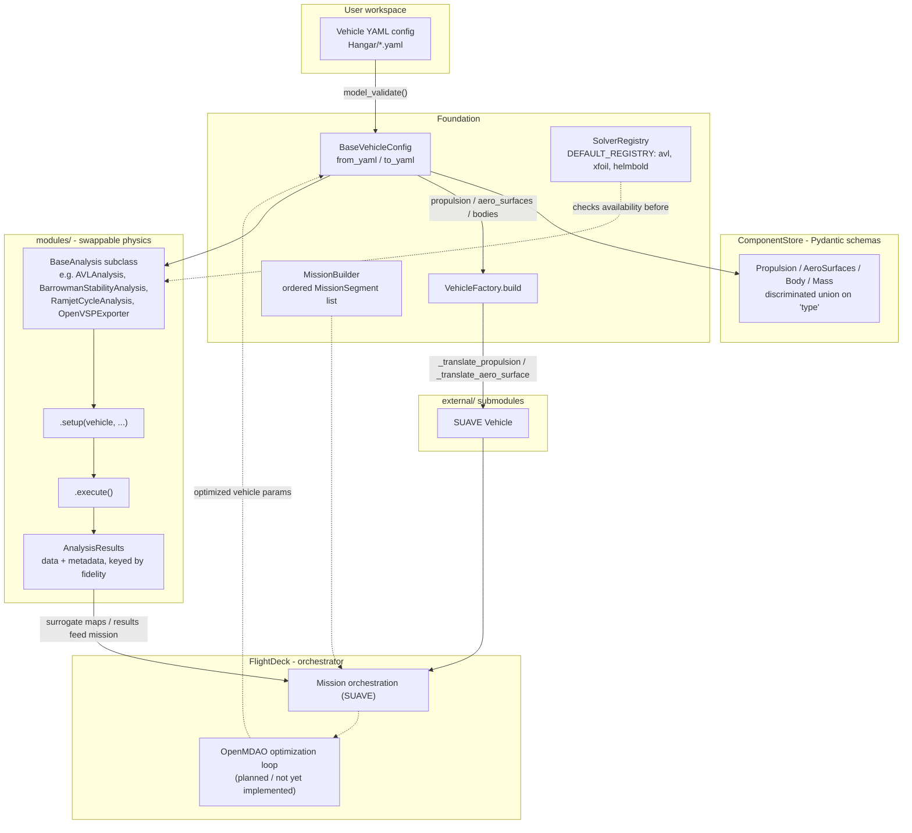

# YAADO Repository Map

> Onboarding/learning reference. Not authoritative documentation — when in doubt, read the
> source files linked below. Generated from the repository contents as of the current
> `main` branch.

## 1. What is YAADO

YAADO (**Y**et **A**nother **A**erospace **D**esign **O**ptimizer) is a **general,
vehicle-agnostic** preliminary design and Multidisciplinary Design Optimization (MDO)
framework, built by MELprop for use by Polish Science Clubs. It acts as a strict,
user-friendly superstructure over complex physics engines (SUAVE, SU2, pyCycle,
OpenVSP).

Key framing (see `CLAUDE.md`, `README.md`, `ONBOARDING.md`):

- **Declarative design.** Vehicles are built from YAML configs validated by Pydantic v2
  schemas — no Python programming required for end users.
- **Variable fidelity.** The same physical question (e.g. lift-curve slope, inlet
  recovery) can be answered by an empirical handbook formula (L0), a linear method like
  AVL/XFOIL (L1), a medium-fidelity 1-D/Euler method (L2), or high-fidelity CFD/FEM
  (L3) — swappable behind a uniform `BaseAnalysis` interface.
- **Vehicle-agnostic core.** `YAADO_Core/` must never hardcode a specific vehicle or
  import from `Hangar/`. Vehicles are assembled by *composition* of generic Pydantic
  "Lego brick" components; solvers are extended by *inheritance* from `BaseAnalysis`.
- **Hidden OpenMDAO.** `FlightDeck` intends to wrap OpenMDAO's optimization engine and
  SUAVE's mission evaluation so end users never touch OpenMDAO `Problem()`/`Component`
  wiring directly (see `YAADO_Core/FlightDeck/README.md` — this is a stated
  architectural vision, largely **planned/not yet implemented** in code).

## 2. Top-Level Layout

```text
├── YAADO_Core/     # Core framework — generic, vehicle-agnostic, extend via inheritance
│   ├── Foundation/     # Base abstractions: BaseAnalysis, FidelityLevel, vehicle config/factory, missions, solver registry
│   ├── FlightDeck/     # Mission & optimization orchestrator (SUAVE + OpenMDAO) — architecture doc only, no code yet
│   ├── ComponentStore/ # Pydantic v2 "Lego brick" component schemas (strict validation)
│   ├── modules/        # Swappable physics solvers, grouped by discipline
│   └── tests/          # Pytest suite, mirrors the module tree 1:1
├── Hangar/         # User workspace: declarative vehicle YAML configs (currently just a package stub)
├── FlightLogs/     # User workspace: output data, logs, custom study scripts (currently just a package stub)
└── external/       # Git submodules: SUAVE, pyCycle, SU2, OpenVSP (pinned versions)
```

`Hangar/` and `FlightLogs/` currently contain only an `__init__.py` each — real vehicle
configs and study scripts are expected to be added here by users/science-club teams.

## 3. Core Layers (`YAADO_Core/Foundation/`)

### `analysis_base.py`

- **`FidelityLevel`** (`IntEnum`) — the fidelity ladder every analysis declares itself
  against:
  - `LEVEL_0` — analytical / handbook correlations (instant).
  - `LEVEL_1` — linear methods (VLM/AVL, XFOIL, DATCOM-style empirics).
  - `LEVEL_2` — medium fidelity (Euler CFD, 1-D cycle analysis / pyCycle).
  - `LEVEL_3` — high fidelity (RANS CFD, FEM).
- **`AnalysisResults`** (`dataclass`) — uniform output container for any
  `BaseAnalysis`: `name`, `fidelity`, `data: dict[str, float]` (SI-unit scalar
  outputs keyed by symbol, e.g. `CL`, `CD`), `metadata: dict[str, Any]`. Supports
  `results["CL"]` and `"CL" in results`.
- **`BaseAnalysis`** (`ABC`) — abstract base every physics method derives from.
  Subclasses set a class-level `fidelity` and implement `setup(...)` /
  `execute() -> AnalysisResults`. `validate_results()` gives a default sanity check
  (non-empty results), overridable with physics-based checks.

> **Discrepancy note:** `YAADO_Core/FlightDeck/__init__.py` imports
> `BaseComponent` and `ComponentRegistry` from `YAADO_Core.analysis_base`, but
> neither class exists anywhere in the repo (and the module path
> `YAADO_Core.analysis_base` is itself wrong — the real module is
> `YAADO_Core.Foundation.analysis_base`). Importing the `FlightDeck` package would
> therefore fail at runtime; the test suite does not catch this because nothing
> imports `FlightDeck` yet. These pieces are **planned/not yet implemented**.
> (`YAADO_Core/Foundation/__init__.py` is currently empty.)

### `vehicle_base.py`

- **`BaseVehicleConfig`** (Pydantic `BaseModel`, `extra="forbid"`) — the universal
  vehicle blueprint. Fields: `name`, `description`, and three composition
  dictionaries — `propulsion: dict[str, AnyPropulsionComponent]`,
  `aero_surfaces: dict[str, AnyAeroComponent]`, `bodies: dict[str, AnyBodyComponent]`
  — plus an optional top-level `mass_properties`. Provides `from_yaml()` /
  `to_yaml()` for loading/saving vehicle configs.

### `vehicle_factory.py`

- **`VehicleFactory`** — translates a validated `BaseVehicleConfig` into a SUAVE
  `Vehicle` object. SUAVE import is guarded (`SUAVE_AVAILABLE` flag) so the module
  loads even without the submodule installed; `build()` raises `RuntimeError` only
  when SUAVE is actually needed. Dispatches per-component by `isinstance` (not a
  removed `vehicle_type` discriminator):
  - `_translate_propulsion`: `SolidMotor → Solid_Propulsion`,
    `RamjetEngine → Ramjet`, `TurbojetEngine → Turbojet` SUAVE networks.
  - `_translate_aero_surface`: `Wings → Wing`, `Fins → Wing` (vertical=True).
  - Unknown component types raise `TypeError`.

### `mission_builder.py`

- **`MissionSegment`** (`dataclass`) — one segment: `name`, `segment_type` (e.g.
  `"climb"`, `"cruise"`, `"boost"`, `"staging_event"`), `parameters` (SI units).
- **`MissionBuilder`** — fluent builder (`.add_segment(...).add_segment(...).build()`)
  producing an ordered `list[MissionSegment]`, kept solver-agnostic (a later
  workflow maps segments onto SUAVE or an OpenMDAO trajectory).

### `solver_registry.py`

- **`SolverInfo`** (`dataclass`) — metadata for an external tool (`name`,
  `executable`, `description`); `is_available()` checks `shutil.which`.
- **`SolverRegistry`** — `register`/`get`/`available()` mapping of solver name →
  `SolverInfo`.
- **`DEFAULT_REGISTRY`** — pre-populated with `avl` (Athena Vortex Lattice),
  `xfoil` (XFOIL 2-D panel method), and `helmbold` (pure-Python analytical
  lift-slope correlation, always "available").

## 4. ComponentStore (Pydantic Schemas)

All schemas use `model_config = ConfigDict(extra="forbid")`, SI-unit field-name
suffixes (`_N`, `_m`, `_s`, `_kg`, `_deg`, `_K`, `_Pa`, ...), and a frozen `type`
discriminator literal so component dicts can be validated as a discriminated union.
This is the "Lego brick" / composition pattern described in
`YAADO_Core/ComponentStore/README.md`: vehicles are built by snapping generic
components together in YAML rather than by rigid per-vehicle-type templates.

- **`propulsion.py`**
  - `SolidMotor` (`type="solid_motor"`) — SRM: `isp_vacuum_s`, `isp_sl_s`,
    `propellant_mass_kg`, `burn_time_s`, `thrust_mean_N`, `thrust_peak_N`,
    `propellant_density_kg_m3`, optional casing dims, optional `mass`. Cross-checks
    peak ≥ mean thrust and mean thrust vs. `Isp·mdot·g0` (within 3x).
  - `RamjetEngine` (`type="ramjet_engine"`) — `design_mach` (1.5–6.0),
    `combustor_temp_K`, `nozzle_area_ratio`, optional throat/exit diameters
    (cross-checked against the area ratio).
  - `TurbojetEngine` (`type="turbojet_engine"`) — `thrust_N`, `sfc_kg_per_Ns`,
    `mach_range` (validated increasing, ≥0), several optional performance/geometry
    fields.
  - `AnyPropulsionComponent = Annotated[SolidMotor | RamjetEngine | TurbojetEngine, discriminator="type"]`.
- **`aero_surfaces.py`**
  - `ControlSurface` — nested (not top-level `type`-discriminated) leaf attached to a
    wing/fin: `function` (`aileron`/`flap`/`elevator`/`rudder`/`custom`),
    span/chord fractions, `max_deflection_deg`.
  - `Wings` (`type="wing"`) — `aspect_ratio`, `sweep_deg`, `taper_ratio`, `span_m`,
    `dihedral_deg`, airfoil designations, `control_surfaces: list[ControlSurface]`.
    Defaults `airfoil_tip` to `airfoil_root` if omitted.
  - `Fins` (`type="fins"`) — radial rocket fin set: `count` (3–8), `span_m`,
    `sweep_deg`, optional root/tip chords, `control_surfaces`.
  - `AnyAeroComponent = Annotated[Fins | Wings, discriminator="type"]`.
- **`body.py`**
  - `AxisymmetricBody` (`type="axisymmetric_body"`) — `length_m`, `diameter_m`,
    `nose_type` (`ogive`/`conical`/`hemispherical`), optional nose/total
    length/diameter fields.
  - `AnyBodyComponent = Annotated[AxisymmetricBody, discriminator="type"]` (single
    member today — extend by adding more body types to the union).
- **`mass.py`**
  - `MassProperties` (`type="mass"`) — `cg_from_nose_m`, `cg_source` (provenance
    string), optional `total_mass_kg`. Used both nested inside components and as
    the vehicle-level `mass_properties` override.
- **`__init__.py`** — re-exports all component classes plus a top-level
  `AnyComponent = Annotated[MassProperties | AnyBodyComponent | AnyPropulsionComponent | AnyAeroComponent, discriminator="type"]`.

## 5. Physics Modules (`YAADO_Core/modules/`)

Each subpackage groups related solver "methods." Classes that subclass
`BaseAnalysis` and their declared `FidelityLevel` are called out; most modules also
contain free functions (pure physics/utility code) that back those classes and/or
standalone CLI-style scripts (`main()`).

### `wind_tunnel/` — aerodynamics

- `methods/avl/avl_wrapper.py` — `helmbold_cl_alpha()` analytical finite-wing
  lift-slope correlation, `avl_is_available()`; **`AVLAnalysis(BaseAnalysis)`**,
  `fidelity = LEVEL_1` — VLM analysis via AVL.
- `methods/avl/avl_builder.py` — `build_avl_deck()` generates an AVL input deck from
  a vehicle config; **`AVLFinAnalysis(BaseAnalysis)`**, `fidelity = LEVEL_1`.
- `methods/xfoil/xfoil_runner.py` — `ackeret_polar()` supersonic thin-airfoil
  correlation, `XfoilCase` dataclass; **`XFOILAnalysis(BaseAnalysis)`**,
  `fidelity = LEVEL_1` — 2-D panel-method airfoil analysis via XFOIL, plus a polar
  plotting helper and `main()`.
- `methods/su2/su2_config_template.py` — ISA atmosphere, SU2 `.cfg` file generation
  for Mach sweeps and Mach/AoA grids; **`SU2ConfigGeneration(BaseAnalysis)`** and
  **`SU2ConfigGenerator(BaseAnalysis)`**, both `fidelity = LEVEL_2` — generate
  (Euler/RANS-tier) CFD case configs rather than run SU2 directly.

### `powerplant/` — propulsion cycle & inlet analysis

- `inlet_methods/taylor_maccoll.py` — conical-shock inlet theory: oblique/normal
  shock relations, `solve_conical_shock()`, `evaluate_inlet()` (`InletResult`
  dataclass), `run_matrix()`/`write_csv()`/`main()`. No `BaseAnalysis` subclass —
  pure function library.
- `inlet_methods/wedge.py` — 2-D wedge/spike inlet theory: ISA atmosphere, oblique
  shock trains, MIL-E-5007 recovery correlation, multi-cone inlet optimization,
  movable-inlet actuation kinematics. **`InletPerformanceAnalysis(BaseAnalysis)`**
  and **`MultiConeInletPerformanceAnalysis(BaseAnalysis)`**, both
  `fidelity = LEVEL_0` (analytical shock-relation correlations).
- `cycle_methods/heiser_pratt.py` — ramjet/scramjet cycle relations (`CycleInputs`,
  `CycleResult` dataclasses, `evaluate_cycle()`), area-ratio/Mach helpers. No
  `BaseAnalysis` subclass.
- `cycle_methods/mattingly.py` — closed-form ideal ramjet cycle
  (`ideal_ramjet_closed_form()`), nozzle exit conditions;
  **`RamjetCycleAnalysis(BaseAnalysis)`**, `fidelity = LEVEL_2` (1-D cycle
  analysis).
- `cycle_methods/grzywka.py` — combustor/nozzle sizing (choked throat area, fully
  expanded exit, Brayton temperature estimate);
  **`GrzywkaCombustorNozzleAnalysis(BaseAnalysis)`**, `fidelity = LEVEL_2`.

### `stability_control/` — static stability & control margins

- `methods/barrowman/barrowman_stability.py` — classic Barrowman method:
  `RocketGeometry`, per-component `Cn_alpha`/CP contributions (nose, transition,
  fins), Mach correction, `StabilityResult`;
  **`BarrowmanStabilityAnalysis(BaseAnalysis)`**, `fidelity = LEVEL_0`.
- `methods/barrowman/barrowman_extended.py` — extended Barrowman with Galejs body
  lift contribution, static margin in calibers, fin-span sensitivity sweeps
  (`find_neutral_span_m()`); **`BarrowmanExtendedAnalysis(BaseAnalysis)`**,
  `fidelity = LEVEL_0`.
- `methods/datcom/datcom_class_sweep.py` — supersonic nose-cone/fin `Cn_alpha`+CP
  correlations (DATCOM-style empirics) and a Mach sweep of static margin. No
  `BaseAnalysis` subclass (function-based sweep + `main()`).
- `methods/ackeret/ackeret_fin_check.py` — Ackeret linearized supersonic
  thin-airfoil theory applied to fin `Cn_alpha`/CP, whole-vehicle static-margin
  check, markdown report writer. No `BaseAnalysis` subclass.

### `airframe/` — geometry generation and meshing

- `generator_methods/openvsp.py` — builds an OpenVSP `.vspscript` from a vehicle
  config (`build_vspscript()`), export manifest; **`OpenVSPExporter(BaseAnalysis)`**,
  `fidelity = LEVEL_0` (geometry generation, not a physics solve).
- `slicer_methods/gmsh.py` — Gmsh-based STEP mesh utilities: opens STEP geometry,
  slices a solid volume at longitudinal stations, classifies face loops (solid vs.
  hollow), cross-checks sliced cross-sections against the vehicle config,
  `run_station_sweep()`/`write_csv()`/`main()`. No `BaseAnalysis` subclass.

### `flight_dynamics/` — trajectory simulation

- `methods/point_mass_3dof.py` — 3-DOF point-mass boost-phase integrator:
  `BoosterParams`, ISA atmosphere, thrust/drag/mass-vs-time models,
  `boost_dynamics()` ODE RHS with a ground-impact event, `integrate_boost_phase()`
  (SciPy `solve_ivp`), post-processing, launch-angle sweep with
  `recommended_launch_angle_deg()`, plotting, `main()`. No `BaseAnalysis` subclass
  yet — a standalone simulation script.

## 6. Tests (`YAADO_Core/tests/`)

Run the full suite with:

```bash
uv run pytest YAADO_Core/tests/ --tb=short
```

Per `CONTRIBUTING.md`, the test tree must **perfectly mirror** the module tree: a
module at `YAADO_Core/modules/<pkg>/<file>.py` gets tests at
`YAADO_Core/tests/modules/<pkg>/test_<file>.py`. Currently present:

- `tests/ComponentStore/` — `test_aero_surfaces.py`, `test_body.py`,
  `test_mass.py`, `test_propulsion.py` (schema validation coverage).
- `tests/modules/powerplant/` — `test_powerplant_combustor_nozzle.py`,
  `test_powerplant_inlet.py`, `test_powerplant_ramjet_cycle.py`.
- `tests/modules/wind_tunnel/` — `test_wind_tunnel_xfoil_fallback.py`.

Several modules (`Foundation/`, `stability_control/`, `airframe/`,
`flight_dynamics/`) currently have **no corresponding test files** — this is a gap
against the CONTRIBUTING.md mirroring rule, not an architectural statement.

External binaries (AVL, XFOIL, SU2, gmsh) may be missing in a given environment;
tests and the `solver_registry` are designed to detect and gracefully skip/fallback
in that case rather than hard-fail.

## 7. Contributor Rules (Summary)

Full rules live in `CLAUDE.md` and `CONTRIBUTING.md`. Highlights:

1. **Always SI units**, with unit-suffixed field/variable names (`thrust_N`,
   `span_m`, `isp_s`); prefer `openmdao.utils.units` or Pint where useful.
2. **Type hints required** on all public functions.
3. **Google-style docstrings** (English) on every public class/method.
4. **No project-specific logic in Core** — never import a `Hangar/`-specific schema
   or vehicle type into a `YAADO_Core` solver; Core must stay vehicle-agnostic.
5. **Composition for data, inheritance for solvers** — vehicles/Pydantic schemas
   are built by composing generic components (never deep inheritance trees);
   physics methods extend `BaseAnalysis` via inheritance.
6. **Folder READMEs** — any directory representing a distinct subsystem should
   carry its own `README.md` (see `ComponentStore/README.md`, `FlightDeck/README.md`
   as examples).
7. **Branch/commit conventions** — branches: `feature/*`, `fix/*`, `docs/*`;
   commits: `feat:`, `fix:`, `docs:`, `chore:` + topic + description.
8. **Run tests after every change**: `uv run pytest YAADO_Core/tests/ --tb=short`.

## 8. Data & Control Flow (Conceptual)

The diagram below shows the intended flow through the layers described above. Solid
arrows are implemented today; the OpenMDAO optimization loop and the
BaseComponent/ComponentRegistry pieces are **planned/not yet implemented** (shown
dashed).


