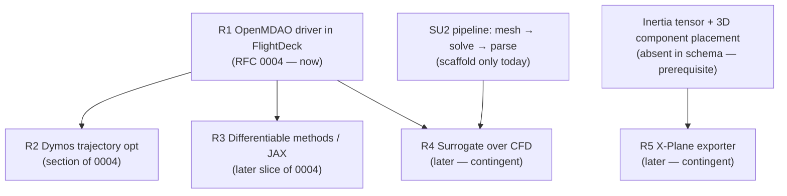

# Research digest — MDO roadmap directions (2026-09)

**Status:** Research reference (not a decision). Feeds RFC 0004.
**Method:** Five parallel read-only research passes (web + repo), one per direction, each
grounding external claims in cited sources and YAADO claims in the actual files. This
document is the orchestrator's consolidation and final RFC verdict per direction.

> 🤖 Auto-generated by Opus (Claude Code) — **not yet reviewed by a human.** Treat as a
> draft research brief pending maintainer review.

## Verdict matrix

| # | Direction | Cost | Blocking prerequisite | RFC verdict (final) |
|---|---|---|---|---|
| R1 | **OpenMDAO** as optimization driver | L | a working FlightDeck orchestrator (none exists yet) | **RFC now** → RFC 0004 (umbrella) |
| R2 | **Dymos** trajectory optimization | L | OpenMDAO loop (R1) | **Section of RFC 0004**, not standalone |
| R3 | **Differentiable** analytic methods (JAX) | S/method, M total | a gradient consumer (R1) | **Later** — a slice of RFC 0004 once a real loop exists |
| R4 | **Surrogate** models over CFD | XL (via prereq chain) | a working SU2 pipeline **and** an optimization loop | **Later** — contingent RFC, backlog issue |
| R5 | **X-Plane** exporter | L/XL | inertia tensor + 3D component placement (absent) | **Later** — contingent RFC, backlog issue |

**One-line conclusion:** exactly one of the five deserves an RFC *now* — OpenMDAO — and it
absorbs Dymos and the differentiable-methods work as sub-parts. The other two (surrogate,
X-Plane) are genuinely valuable but strictly gated behind infrastructure that does not exist
yet, so they are tracked as contingent backlog items, not written up as actionable RFCs.

## Dependency graph

## Cross-cutting findings (verified in-repo)

1. **OpenMDAO is already a (transitive) dependency.** `om-pycycle==4.1.2` pulls
   `openmdao==3.45.0` into `uv.lock`; it is importable today, just unused directly. So R1
   is not a "new heavy dependency" decision — it is a "wire up what's already here" decision.
2. **The optimization vision is already set by the lead engineer.** `YAADO_Core/FlightDeck/README.md`
   (commit `8339c88`, by lead engineer **Arseni10Lk**) states the "Hidden OpenMDAO Engine" design;
   `mission_builder.py` already mentions mapping segments "onto SUAVE mission segments or an OpenMDAO
   trajectory." FlightDeck itself is an empty stub (`__init__.py` only). The *identity* question
   ("analysis tool vs optimization tool") is therefore already answered in the repo's own docs — so
   RFC 0004 does not re-open the direction; it details the **mechanism** for Arseni's outline, with
   the go/no-go left to him.
3. **SU2 integration is scaffold-only.** `wind_tunnel/methods/su2/` only *writes* `.cfg`
   files — it never meshes (gmsh), never invokes `su2_CFD`, and has no results parser. AVL is
   the only real subprocess-backed solver. This is why R4 (surrogate) is XL: it would optimize
   the cost of a CFD pipeline that does not yet run.
4. **No inertia tensor, no 3D layout.** `MassProperties` carries only `total_mass_kg`,
   `cg_from_nose_m` (1-D, longitudinal), `cg_source`. There are zero `Ixx/Iyy/Izz` in Core and
   no per-component x/y/z placement/orientation anywhere in `BaseVehicleConfig`. This blocks
   R5 (X-Plane) **and** any real 6-DOF / lateral stability work — it is a foundational gap, not
   an X-Plane detail.
5. **The analytic methods are unusually autodiff-ready.** Barrowman/Ackeret/DATCOM use stdlib
   `math` on scalars (not even numpy), so a JAX (`jnp`) rewrite is ~S per formula, and OpenMDAO's
   native `JaxExplicitComponent` makes such a rewrite directly reusable as an OM component.

## Per-direction briefs (condensed)

### R1 — OpenMDAO as optimization driver → **RFC now (0004, umbrella)**
OpenMDAO wires `ExplicitComponent`s into a graph and propagates **analytic derivatives** across
it (adjoint/forward), which is what makes many-variable coupled MDO tractable versus a plain
finite-difference loop. It ships `ExternalCodeComp` for opaque CLI solvers (the AVL/XFOIL/SU2
pattern) and per-component `fd`/`cs` approximation. Integration into YAADO: one generic
`BaseAnalysis → ExplicitComponent` adapter (mutating a `BaseVehicleConfig` copy per iteration,
copying `AnalysisResults.data` into outputs); the driver lives in FlightDeck; Pydantic
`Field(ge=, le=)` bounds map onto `add_design_var(lower=, upper=)`. **The hard part is
derivatives:** subprocess solvers (AVL/XFOIL/SU2) have no Jacobians, so the realistic first
slice is FD around external binaries + CS/analytic around the cheap `LEVEL_0` correlations.
Open scope decision: optimize `BaseAnalysis` outputs directly vs route through SUAVE's mission
(the README vision) — the latter collides with the unresolved SUAVE-isolation RFC (#41). Sources:
OpenMDAO docs (PyPI, ExternalCodeComp, complex-step, approximating-partials), pyCycle README.

### R2 — Dymos trajectory optimization → **section of RFC 0004**
Dymos is a collocation/optimal-control layer **on** OpenMDAO: define `Phase`s with states,
dynamic controls, and an ODE `ExplicitComponent`; the NLP drives "defect" residuals to zero.
It replaces the *shooting* core of `point_mass_3dof.py` (`boost_dynamics` + `solve_ivp`), not the
whole file — the pure physics (ISA atmosphere, drag, Isp, mass) transfers 1:1 into the ODE
component. Two natural phases map the real vehicle: solid boost (`SolidMotor`) → ramjet cruise
(`RamjetEngine`) with a phase linkage, turning "fixed launch angle / fixed Mach 2.0 cruise" into
an optimized `alpha(t)` / speed-altitude profile. Requires smoothing the hard `CD(Mach)` step
(non-differentiable) and vectorizing the RHS; may pull in `pyoptsparse`/IPOPT (a real new
dependency) for robust convergence. Because it *is* the OpenMDAO vision applied to trajectories,
it belongs as a named section of RFC 0004, not a parallel document. Sources: Dymos docs
(transcriptions, Phase API, collocation notebook, defining-ODEs).

### R3 — Differentiable analytic methods (JAX) → **later, a slice of RFC 0004**
Barrowman/Ackeret/DATCOM are closed-form scalar `math` — a `jnp` rewrite is ~S per formula and
reusable as OpenMDAO `JaxExplicitComponent`s. But nothing consumes a gradient today (FlightDeck
empty; `AnalysisResults` is a non-differentiable `dict[str,float]`). Doing it now = speculative
API surface with no consumer. Real risks to resolve when it *is* done: the `fin_mach_correction_factor`
piecewise-Mach branch is non-smooth (AD exposes a meaningless kink derivative — a physics issue,
not a code bug), and JAX defaults to float32 (`jax_enable_x64` must be set or the cross-check
validators silently degrade). Revisit when the optimizer needs real gradients. (AeroSandbox — the
cited precedent — actually uses CasADi+IPOPT, not JAX, in a simultaneous-analysis-and-design
style.) Sources: JAX docs, OpenMDAO `JaxExplicitComponent`, AeroSandbox thesis/repo.

### R4 — Surrogate models over CFD → **later, contingent RFC (backlog)**
Kriging/GP (SMT, or OpenMDAO's already-vendored `MetaModelUnStructuredComp`), LHS DoE, and EGO
adaptive infill are the standard toolkit; SUAVE even ships a reference surrogate implementation.
A `SurrogateAeroAnalysis(BaseAnalysis)` fits the existing pattern cleanly, tagging results with
the *source* fidelity + a `metadata["surrogate"]=True` flag (no `FidelityLevel` change). **But** a
surrogate accelerates an expensive loop that doesn't exist over a CFD pipeline that doesn't run:
SU2 is config-only (no mesh/solve/parse) and FlightDeck has no optimization loop. Cost is XL only
because of that prerequisite chain; the surrogate slice itself is S–M. Revisit immediately after
SU2 executes end-to-end. Sources: Forrester et al. 2008, SMT docs/paper, EGO (Jones 1998),
OpenMDAO meta-model docs.

### R5 — X-Plane exporter → **later, contingent RFC (backlog)**
A pilot-in-the-loop **verification/QA** tool, not core MDO. The `.acf` format is thinly and
unofficially documented (best reference is the reverse-engineered ACFTools, with acknowledged
gaps; Laminar's own docs were unreachable from the sandbox — a research-completeness caveat), so
a writer is R&D, not integration. Hard blocker: **inertia tensor + 3D component placement are
absent** from the schema, and even a crude estimate is unsupportable (roll inertia needs radial
mass distribution the schema cannot express). X-Plane's real-time blade-element aero also wants
per-section airfoil polars, not just a NACA string. Sequence strictly after the inertia/placement
gap is closed **for its own sake** (needed by any 6-DOF/S&C work regardless of X-Plane). Sources:
X-Plane Plane Maker manual / text-`.acf` guidelines (referenced), ACFTools repo, Weight & Balance
wiki.

## Recommendations & sequencing

1. **RFC 0004 (OpenMDAO optimization engine in FlightDeck)** details the mechanism for the direction
   lead engineer **Arseni10Lk** already outlined in `FlightDeck/README.md`, scoped to a
   BaseAnalysis-direct loop first (skip SUAVE routing to de-risk against RFC #41), with Dymos and
   differentiable methods as sub-parts. It is a proposal for Arseni's review — the go/no-go is his.
2. **Close the two foundational gaps as their own tracked work**, because multiple directions
   depend on them and neither is X-Plane/surrogate-specific:
   - Vehicle **spatial layout + inertia tensor** schema (unblocks X-Plane and 6-DOF/S&C).
   - **SU2 execution** (mesh → solve → parse) turning the scaffold into a real solver (unblocks
     surrogate and any real CFD).
3. **Park surrogate (R4) and X-Plane (R5) as contingent backlog issues**, each naming its
   prerequisite, to be promoted to RFCs when their gate clears.
4. Differentiable methods (R3) need no separate tracker — they are an explicit future slice inside
   RFC 0004.

## Sources
Full per-direction source lists (OpenMDAO, Dymos, JAX/AeroSandbox, SMT/EGO, X-Plane/ACFTools) are
inlined in each condensed brief above; the underlying research passes cited them individually.

---
_Generated by [Claude Code](https://claude.ai/code)_
