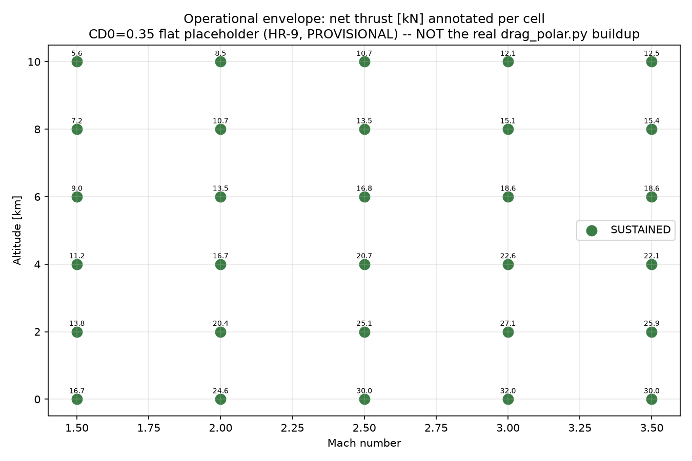
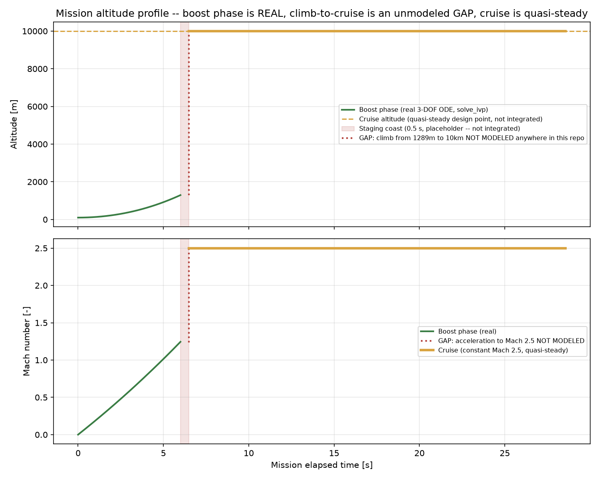
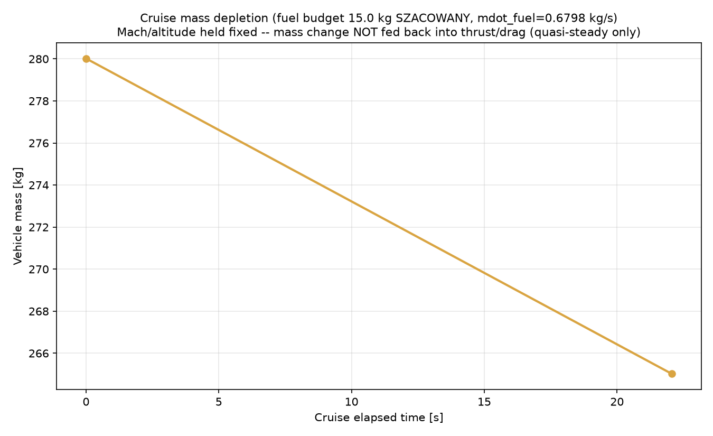

# MELprop ramP — Team Review Snapshot (2026-07-11)

**Project:** Project B — two-stage rocket (solid booster + ramjet cruise), Mach 2.5 design point.
**Phase:** heading toward CDR. **#1 blocker:** stability sign-flip between analytical methods (+5…+11 cal, STABLE) and the reference Teltik 2024 CFD point (-2.75 cal, UNSTABLE) — **still PENDING**, not resolved either way. SU2 RANS-SST, the designated arbiter, has not been run (`BLOCKED_BY_ENVIRONMENT` in every cloud session so far).

This is a **snapshot for a team meeting**, not new analysis. Every number below is
pulled from a file actually committed to this repo as of the source commit in the
footer — nothing is taken from memory, from the research documents referenced in
recent sessions, or from chat history. Status badges (**CONFIRMED** /
**PROVISIONAL** / **BLOCKED/TBD**) are transcribed from what `docs/decision-log.md`
and `docs/assumptions.md` actually say about each item, not upgraded for a
cleaner chart.

---

## 1. Vehicle overview

Source: `vehicles/ramjet_rocket/vehicle_config.yaml` (v0.2.0).

| Parameter | Value | Status | Note |
|---|---|---|---|
| Total length | 4.35501 m | **CONFIRMED** | Drawing-verified 2026-07-10 ("CFD Simplified Single Rocket Model", DWG 10/07/2026), supersedes Fusion 4.377 m |
| Body diameter (cylindrical) | 0.200 m | **CONFIRMED** | Drawing-verified, supersedes Fusion 0.250 m |
| Nose length / diameter | 0.293 m / 0.150 m | **CONFIRMED** | Unchanged by the drawing update, conical |
| `max_diameter_m` (booster bbox incl. wings) | 0.639 m | **BLOCKED/TBD** | Unchanged Fusion value; flagged in-YAML as needing review now that fin span dropped — not touched, no functional code reads this field |
| Fin count / sweep | 4 / 29.98° | **CONFIRMED** | Drawing-verified, supersedes Fusion 0° (rectangular) |
| Fin span (semi-span) | 0.550 m | **BLOCKED/TBD** | MODERATE confidence — layout-inferred reading of the drawing's tail-area "550" dimension, **not** a labeled callout. `docs/decision-log.md` 2026-07-11 entry: source PDF unavailable to the last two sessions, still unresolved |
| Fin root/tip chord | 0.1768 m (both) | **BLOCKED/TBD** | Unchanged Fusion value — a swept planform likely implies a non-rectangular chord the drawing may describe, not confidently remapped |
| Nozzle throat / exit diameter | 0.210 m / 0.241 m | **CONFIRMED** | Drawing-verified real dimensions |
| Nozzle area ratio | 1.317 | **CONFIRMED** (input) / **PROVISIONAL** (validation) | Real dimensioned Laval nozzle, replaces the old 4.0 design-intent placeholder — resolves HR-3's geometry question. Downstream V3 cross-check vs CFD still has a +14.6% residual gap (Section 3) |
| Booster (stage 1) diameter | 0.250 m | **CONFIRMED** | Explicitly investigated and human-confirmed distinct from the 0.241 m nozzle exit — "outer diameter is 0.25, internal channel nozzle 0.241" |
| CG from nose | 1.6084 m (36.7% L) | **CONFIRMED** (source) / used as **PROVISIONAL** anchor | Fusion 360 Assembly v6, component breakdown. Stability analyses sweep CG 0.37–0.64 L since the true operational CG isn't locked |
| **Moments of inertia (Ixx/Iyy/Izz)** | — | **BLOCKED/TBD** | Not extractable via API — requires a human to open Fusion Assembly v6 GUI → Physical Properties. **Never defaulted or guessed** |
| Total mass | 355.02 kg | **CONFIRMED** (source) | Fusion physics engine (booster 277.8 + ramjet 15.18 + other) |
| Stage-1 propulsion (Isp, thrust, burn time, propellant mass) | see YAML | **BLOCKED/TBD** (SZACOWANY) | All estimated placeholders pending the real motor datasheet (HR-4) |

---

## 2. HR blocker board

Source: `docs/ramP/human_review_night4.md` (HR-1..HR-9 registry) cross-checked
against the latest status in `docs/decision-log.md` / `docs/assumptions.md`.

| ID | Item | Status | Current note |
|---|---|---|---|
| HR-1 | Fin span | **BLOCKED/TBD** | Now 0.550 m (drawing-derived, was 0.6685 m Fusion-derived) — still layout-inferred, not a confirmed labeled dimension. Source PDF unavailable to the last two review sessions |
| HR-2 | Teltik CFD geometry match vs Fusion Assembly v6 | **BLOCKED/TBD** | No update since Night-4; still the CFD reference point the stability gate can't reconcile with |
| HR-3 | Nozzle Laval vs cylindrical decision | **CONFIRMED** (input) | Resolved with a real dimensioned nozzle (AR=1.317, throat 0.210 m, exit 0.241 m) — no longer a placeholder |
| HR-4 | Stage-1 motor datasheet | **BLOCKED/TBD** | No update — thrust/Isp/burn-time remain SZACOWANY estimates |
| HR-5 | Moments of inertia | **BLOCKED/TBD** | Explicitly NOT used this session (swept CG only); still needs manual Fusion GUI extraction |
| HR-6 | `max_rpm` units ambiguity (rev/min vs rad/s) | **BLOCKED/TBD** | No update — team naming-convention decision needed |
| HR-7 | Combustor T04 = 2000 K source/confirmation | **PROVISIONAL** | Cycle rebuilt around the given value (Stage 2, 2026-07-11); status `RECALCULATED_WITH_CORRECTED_GAMMA_AND_GEOMETRY`, still pending independent CEA/SU2 confirmation |
| HR-8 | Gamma treatment (constant vs composition-consistent) | **PROVISIONAL** | Qualitatively answered — gamma is a WEAK lever (V3 moves ~0.5% over the full 1.20–1.40 sweep); the geometry correction, not gamma, closed most of the legacy gap. Quantitative CEA confirmation still pending |
| HR-9 | Operational-envelope drag model (CD0=0.35 placeholder) | **BLOCKED/TBD** | Still a flat placeholder in `analyses/mission/operational_envelope.py` — the real Mach-dependent drag buildup now exists in `analyses/aero/drag_polar.py` but is **not wired into** the envelope calc |

---

## 3. Stability panel


Source: `analyses/stability/results/datcom_class_sweep_summary.json`,
`analyses/stability/results/ackeret_fin_check.md`, `docs/decision-log.md`
(Barrowman and Teltik values quoted verbatim).

- **DATCOM-class sweep** (Mach 2.5, CG 0.37–0.64 L): **+5.13 to +11.01 cal**, STABLE at every CG tested. **PROVISIONAL.**
- **Ackeret independent hand-check** (Mach 2.5, config CG=1.6084 m): **+9.71 cal**, STABLE. **PROVISIONAL.**
- **Barrowman** (basic +8.99 cal / extended +4.594 cal, Ma 2.5): **RETIRED as the CDR gate** 2026-07-11 — valid only to ~Mach 0.7, and these fins (semi-span/diameter = 2.75) violate its small-fin assumption. Kept for historical reference only.
- **Teltik 2024 CFD** (single point): **-2.75 cal, UNSTABLE.** Directly conflicts with all three analytical methods.
- **Why the analytical methods agree with each other but not the CFD (per `docs/decision-log.md`):** all three place the fin center of pressure far aft (~4.43 m from nose) because linear supersonic theory can't capture the nonlinear fin-effectiveness loss on fins this large; the CFD shows the net CP moving forward instead. This is a **fidelity-class limitation shared by every analytical method here**, not evidence the CFD is wrong.
- **Gate verdict:** 2 analytical methods vs 1 CFD point — **NOT satisfied**. SU2 RANS-SST is the designated tie-breaker and has not run in any cloud session (`BLOCKED_BY_ENVIRONMENT`). **Do not treat the vehicle's Ma 2.5 static stability as resolved in either direction.**

---

## 4. Propulsion cycle panel


Source: `analyses/propulsion/validation/v3_recalc_post_geometry_and_gamma.md`,
`analyses/propulsion/validation/gamma_sensitivity.csv`.

- Legacy model (fully-expanded nozzle assumption, implied AR≈2.44): **V3 = 1474 m/s**.
- Rebuilt `cycle_v2` (Heiser & Pratt, real AR=1.317, gamma_hot=1.28 nominal): **V3 = 1200 m/s** (-18.6% vs legacy).
- Teltik CFD reference: **V3 = 1047 m/s**. Rebuilt-model delta vs CFD: **+14.6%**, down from the legacy model's **+40.8%**.
- **Key finding:** the nozzle **area-ratio geometry correction**, not gamma, closed most of the gap (~26 of ~41 gap-points). Gamma is a **weak lever** — V3 moves only ~0.5% across the full 1.20–1.40 sweep.
- Residual +14.6% vs CFD is attributed to 1-D model limitations (nozzle boundary-layer/divergence loss, real-gas effects, spillage) — expected to be closed by a real NASA-CEA run and/or SU2, not by further gamma tuning.
- **Status: PROVISIONAL.** Both CEA and SU2 cross-checks are `BLOCKED_BY_ENVIRONMENT` in every cloud session so far.

### 4b. Cycle station table (detailed breakdown)

Requested addendum: station-by-station breakdown of the `cycle_v2` (Heiser &
Pratt) model at its nominal design point (Mach 2.5 / 10,000 m ISA,
gamma_hot=1.28), read directly off `CycleResult` fields already computed by
`evaluate_cycle()` — no new station-level modeling added, this is exactly
what the model already produces.

| Station | Name | T_static [K] | p_static [Pa] | Mach | Area [cm²] | Note |
|---|---|---|---|---|---|---|
| 0 | Freestream | 223.1 | 26,436 | 2.500 | — | static; tt0=502.1 K, pt0=451,682 Pa |
| 2 | Diffuser exit | — | — | — | — | **total only**: tt2=502.1 K (=tt0, adiabatic), pt2=394,800 Pa (eta_inlet=0.8741 applied) |
| 4 | Combustor exit | — | — | — | — | **total only**: tt4=2000.0 K (input), pt4=352,319 Pa (pi_cc=0.8924 applied). f_fuel_air=0.0555 |
| throat | Nozzle throat (choked) | — | — | 1.000 | 518.79 | Ma=1 by construction |
| e / 9 | Nozzle exit | 1451.4 | 78,908 | 1.643 | 683.25 | v_exit=1199.9 m/s; AR=1.317 (real, drawing) |

**Why stations 2 and 4 have no static T/p/Mach:** this 1-D model (like the
Heiser & Pratt framework it's built on) tracks **total (stagnation)
conditions** through the diffuser and combustor and only resolves static
conditions where a duct Mach number is actually computed — the throat
(choked, Ma=1 by construction) and the exit (from the real area ratio).
Duct-internal static conditions/Mach at stations 2 and 4 are **not modeled
anywhere in this repo**; reporting a static value there would be invented,
not read from the model. **Status: PROVISIONAL** (same basis as Section 4 —
CEA/SU2 cross-checks not yet run). Full CSV: `team_review_2026-07-11/cycle_v2_station_table.csv`.

---

## 5. Inlet / nozzle panel


Source: `analyses/propulsion/inlet_performance_v2.csv`,
`analyses/propulsion/inlet_results.json` (`multi_cone_redesign` key),
`analyses/propulsion/nozzle_expansion_check.csv`.

- **As-drawn geometry (v2, proper Taylor–Maccoll conical flow):** the 42° spike half-angle is **attached** at Mach 2.5 (a 2-D wedge model wrongly predicted detachment — the axisymmetric solution stays attached to ~46.1°). Recovery is **0.639 vs the MIL-E-5007D reference goal 0.870** — both the 42° and the alternate 21°-reading interpretations fall short at every Mach tested (2.0/2.5/3.0). The Mach-2.0 point for the 42° reading is a detached-shock case (bow-shock bound, not a true attached value — shown in the chart as reported by the solver but flagged here as a conservative bound, not a confirmed operating point).
- **Off-design:** the 42° cone **detaches below Mach ≈2.1**, setting a hard floor on the booster→ramjet **staging Mach**.
- **4-cone chain concept** (a separate redesign variant, not the as-drawn single-surface geometry): **0.874, PASSES** the MIL goal. The as-drawn 42°/60° two-surface intake sits physically between a single cone and this staged chain; its true recovery needs the internal duct area schedule, which the drawing doesn't provide. **PROVISIONAL.**
- **Nozzle:** at AR=1.317 (drawing), the exit is **under-expanded** (p_exit/p0 ≈ 3.0) across the whole 4–10 km altitude band. A matched expansion would need AR≈2.48 — nearly the legacy model's implied 2.44, confirming the old cycle silently assumed near-full expansion.
- No boundary-layer bleed is modeled anywhere in this panel (recovery numbers are optimistic), and cowl-lip shock-on-lip matching is unverified (not in the drawing). **PROVISIONAL** throughout.

---

## 6. Operational envelope



Source: `analyses/mission/results/operational_envelope.csv`.

- All 30 (Mach × altitude) cells swept — **Mach 1.5–3.5, sea level–10 km — are SUSTAINED** (net thrust positive everywhere, from +5.6 kN at Mach 1.5/10 km to +32.0 kN at Mach 3.0/sea level).
- **This does not currently constrain cruise-point selection** — the envelope is wide open under the present drag model.
- **Caveat (HR-9, BLOCKED/TBD):** this uses a flat `CD0 = 0.35` placeholder, not the real Mach-dependent supersonic drag buildup that now exists in `analyses/aero/drag_polar.py` (body wave drag + friction + fin wave drag + base drag). That buildup has **not been wired into** this envelope calculation. Once it is, some cells — especially high-Mach/low-altitude, where wave drag grows fastest — could move from SUSTAINED to marginal or NOT_SUSTAINED. Treat the "wide open" picture above as optimistic until that integration happens.

---

## 7. Trajectory (requested addendum)



Source: `analyses/trajectory/booster_burnout.py` (called directly for the
boost-phase dense time series — the same `solve_ivp` RK45 3-DOF ODE integration
`main()` runs, not a new model) and `workflows/staged_mission_profile.json`
(the existing quasi-steady cruise design point, parameterized over its own
already-computed duration).

- **Boost phase (0–6.0 s): CONFIRMED, real 3-DOF ODE.** Point-mass, fixed launch angle, `scipy.integrate.solve_ivp` (RK45), ends at burnout: altitude 1289.3 m, Mach 1.233, velocity 413.5 m/s.
- **Staging coast (6.0–6.5 s, 0.5 s duration): BLOCKED/TBD placeholder.** Booster-burnout-to-ramjet-ignition handoff — coast under drag+gravity is flagged "not yet integrated" in the source file; shown as a flat span, not a real trajectory segment.
- **GAP (unmodeled): climb from 1289 m to the 10,000 m cruise altitude, and acceleration from Mach 1.23 to Mach 2.5.** This repo has **no model anywhere** for this segment — cruise is defined as a fixed design point (Mach 2.5 / 10 km ISA), not reached by any integrated trajectory from the boost/staging end state. The dotted red line in the chart marks this honestly as a gap, not an interpolation to be trusted.
- **Cruise (22.06 s duration): PROVISIONAL, quasi-steady only.** Constant Mach 2.5, constant altitude 10 km — matches Section 4/5's design point exactly. Duration and range (16,518.6 m) are derived from the SZACOWANY 15 kg fuel budget and the cycle model's `mdot_fuel_kg_s`, not from an integrated flight path.
- **Cruise mass depletion** (below): mass decreases linearly from 280.0 kg to 265.0 kg over the cruise duration at constant `mdot_fuel=0.6798 kg/s` — but Mach/altitude are held fixed throughout, so this mass change is **not fed back** into thrust or drag (no acceleration/climb response to lightening). A real coupled trajectory (mass-varying EOM) does not exist in this repo.



**Bottom line:** the only part of "trajectory" that's a genuine integrated
simulation is the 6-second boost phase. Everything from staging onward is a
single design point held constant, not a time-evolving flight path — this is
a real gap for the team to weigh, not a rendering limitation.

---

## 8. Roadmap position

No formal PDR/CDR/FRR schedule document is committed to this repo — this section
is a qualitative status marker only, not a sourced schedule.

```
PDR ────────────────●───────────────── CDR ─────── FRR
                     ▲
              you are here:
     geometry frozen from drawing, propulsion cycle
     rebuilt on real geometry, inlet re-analyzed with
     correct conical-flow theory — but the #1 CDR gate
     (stability sign-flip) is still open, and 4 of 9
     HR items remain BLOCKED/TBD (motor datasheet, MOI,
     fin-span PDF re-check, Teltik geometry match).
```

**Items on the critical path to CDR** (from `docs/decision-log.md` next-action notes):
1. SU2 RANS-SST stability cross-check (arbitrates the sign-flip) — needs a local build, `BLOCKED_BY_ENVIRONMENT` in every cloud session so far.
2. Fin-span drawing re-verification (HR-1) — needs direct access to the source PDF.
3. Stage-1 motor datasheet (HR-4) — needs vendor/archive outreach.
4. Fusion GUI moments-of-inertia extraction (HR-5) — manual, not scriptable.

---

## 9. Open questions for the team

- **Fin-span drawing reading (HR-1):** does the drawing's "550" dimension terminate at the fin tip or at the body/hull edge, and is "127" the true fin-alone radial dimension? Two sessions in a row could not access the source PDF to check. **Someone with the PDF needs to look at the tail-fin view directly.**
- **`max_diameter_m` (0.639 m):** does the booster's own wing bounding box change along with the ramjet-stage fin span, or does this field stay as-is? No evidence either way was found in the repo.
- **PR #3 vs PR #4/#5 reconciliation:** PR #3 (open, draft) duplicates work already merged via PR #4; it's stale relative to `main`. Should it be closed, or is there anything in it worth salvaging first? Separately, PR #5 is stacked on PR #4's now-merged branch and needs retargeting to `main`.
- **`drag_polar.py` → `operational_envelope.py` wiring (HR-9):** now that a real supersonic drag buildup exists, should it replace the CD0=0.35 placeholder before the envelope chart above is trusted for cruise-point selection?
- **Fin sweep in the drag buildup:** `drag_polar.py`'s Ackeret wave-drag term has no sweep-angle dependence, even though the fins are now swept 29.98° (were 0°). Does this need a modeling update, or is the current buildup considered good enough pre-CDR?
- **`barrowman_results.json` (historical cache):** now that Barrowman is retired as the CDR gate, should the cached result stay frozen at the pre-drawing-update geometry (as a historical artifact) or be refreshed on the current geometry (still historical either way)? A documentation-policy call, not a physics one.
- **Local SU2/PyFluent execution:** this is the single highest-leverage next step (it's the designated arbiter for the #1 blocker) but requires a local machine/build — status of that effort as of this snapshot is not reflected in this repo (no commits found on any local-CFD branch as of the source commit below).
- **Mission trajectory gap (Section 7):** the climb-to-cruise-altitude and acceleration-to-cruise-Mach segment has no model anywhere in this repo. Is closing that gap (a real coupled EOM integration from staging handoff to cruise onset) worth doing before CDR, or is the quasi-steady cruise design point sufficient for the current design questions?

---

## Provenance

This snapshot was generated on branch `docs/team-review-2026-07-11`, based on
`claude/iade-repo-restructure-00rrro` at commit `a110891841b9c60a88bc68a1f6c5a74337671482`
(includes PR #2's merge, PR #4's full 5-stage rerun, and the PR #2 closeout
reconciliation — `pytest tests/`: 240 passed at that commit). All charts and
tables above are generated directly from files at that commit by
`docs/team_review_2026-07-11/generate_charts.py` (Sections 1–6) and
`docs/team_review_2026-07-11/generate_trajectory_and_stations.py` (Sections
4b and 7 — added on request; both call existing model functions directly,
e.g. `booster_burnout.integrate_boost_phase()`/`postprocess()` and
`cycle_v2.evaluate_cycle()`, and introduce no new physics or assumptions
beyond what those modules already compute).

**Known in-flight ambiguity as of this commit:**
- PR #6 (PR #2 closeout) is open/draft, not yet merged to `main`.
- PR #3 (open/draft) and PR #5 (open/draft) exist with real content but are
  **not merged** and **not reflected** in the numbers above — see Section 9.
- No evidence of local SU2/PyFluent execution results was found in the repo
  as of this commit; the stability and cycle/CEA cross-checks remain
  `BLOCKED_BY_ENVIRONMENT` everywhere this snapshot could check.
- Section 7's trajectory is a genuine gap, not a solved-but-unshown result:
  no file in this repo integrates a flight path from staging handoff to
  cruise onset.
