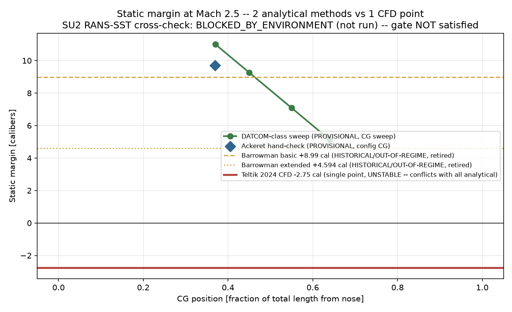
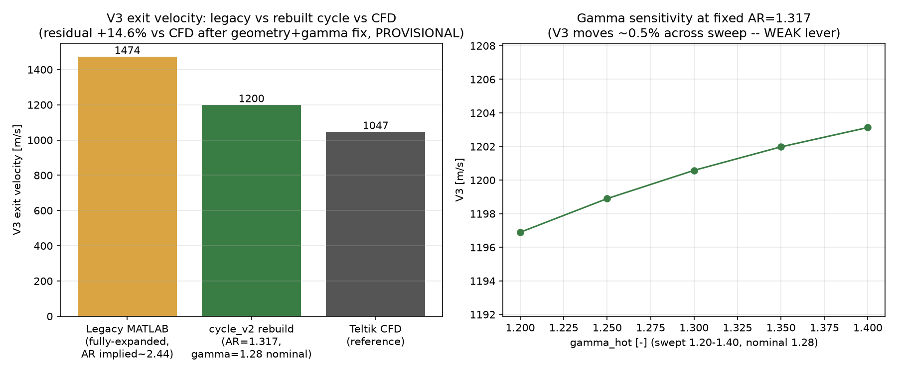
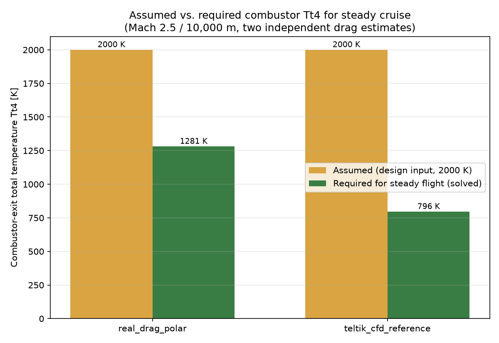
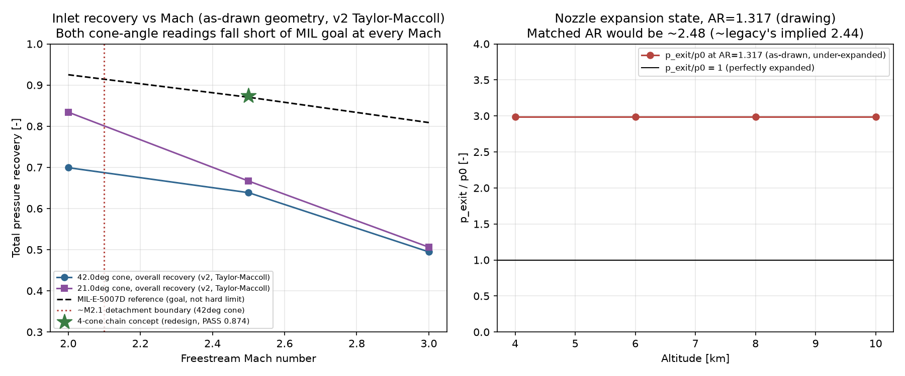
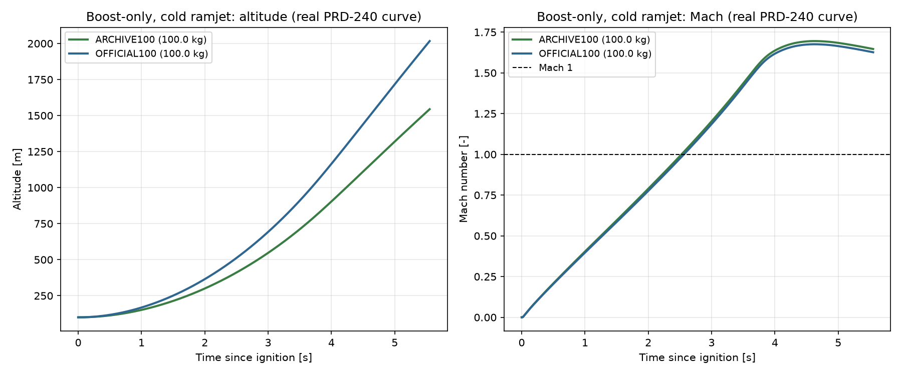
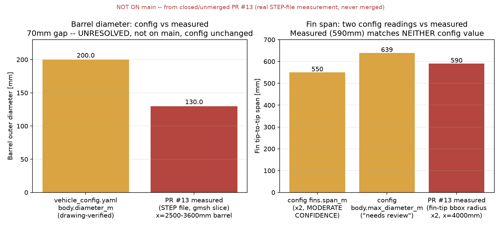

# MELprop ramP — Team Review Snapshot (2026-07-28)

**Project:** Project B — two-stage rocket (solid booster + ramjet cruise), Mach 2.5 design point.
**Phase:** heading toward CDR. **#1 blocker, unchanged since 2026-07-11:** stability
sign-flip between analytical methods (+5…+11 cal, STABLE) and the reference Teltik
2024 CFD point (-2.75 cal, UNSTABLE) — **still PENDING**. SU2 RANS-SST, the
designated arbiter, still has not produced a supersonic result in any session to date.

This is a **snapshot for a team meeting**, not new analysis. Every number below is
pulled from a file actually committed to this repo (or, where explicitly marked,
from a real but closed/unmerged pull request) as of the source commit in the
footer — nothing is taken from memory or from this conversation's chat history.
Status badges (**CONFIRMED** / **PROVISIONAL** / **BLOCKED/TBD**) are transcribed
from what `docs/decision-log.md` and `docs/assumptions.md` actually say about each
item, not upgraded for a cleaner chart.

**This snapshot supersedes the 2026-07-11 one** (`docs/team_review_2026-07-11.md`,
merged as PR #8). 17 days and 6 merged PRs (#9–#12, plus #6/#7 which had already
landed before that snapshot's footer commit) separate the two. The biggest real
changes: the stage-1 motor is no longer a placeholder (real PRD-240 data), the
vehicle's total mass was corrected by 3.55×, the trajectory section is now a real
supersonic result instead of a subsonic one, a new inverse-cycle result exists, and
a real (but unmerged) STEP-file measurement surfaced two unresolved geometry
discrepancies. Everything unchanged since 2026-07-11 (stability, inlet/nozzle,
operational envelope) is carried forward as-is, not re-derived from scratch.

---

## 1. Vehicle overview

Source: `vehicles/ramjet_rocket/vehicle_config.yaml` (v0.2.0), current `main`.

| Parameter | Value | Status | Note |
|---|---|---|---|
| Total length | 4.35501 m | **CONFIRMED** | Unchanged since 2026-07-10 drawing update |
| Body diameter (cylindrical, ramjet stage) | 0.200 m | **CONFIRMED** (config) / **DISPUTED** (see §7) | Drawing-verified; a real but unmerged STEP measurement (PR #13) puts the barrel section at 130.0mm, a 70mm gap — **config not changed**, see §7 |
| Nose length / diameter | 0.293 m / 0.150 m | **CONFIRMED** | Unchanged |
| `max_diameter_m` (booster bbox incl. wings) | 0.639 m | **BLOCKED/TBD** | Unchanged; flagged in-YAML as needing review |
| Fin count / sweep | 4 / 29.98° | **CONFIRMED** | Unchanged |
| Fin span (semi-span) | 0.550 m (⇒ 1100mm tip-to-tip) | **BLOCKED/TBD** | MODERATE confidence, layout-inferred. PR #13's measured tip-to-tip (590mm... see caveat in §7) matches neither this nor `max_diameter_m` |
| Nozzle throat / exit diameter | 0.210 m / 0.241 m | **CONFIRMED** | Unchanged |
| Nozzle area ratio | 1.317 | **CONFIRMED** (input) / **PROVISIONAL** (validation) | Unchanged; V3 cross-check vs CFD still has a +14.6% residual (§4) |
| Booster (stage 1) diameter | 0.250 m | **CONFIRMED** | Unchanged |
| **Stage-1 propulsion (PRD-240 motor)** | peak 17,250 N / mean 10,878 N / burn 5.18 s | **REAL (DATASHEET)** | **Changed 2026-07-11, since the last snapshot.** Real static-test thrust curve promoted into the official config (was SZACOWANY placeholders: peak 29,000 N / mean 25,375 N / burn 6.0 s). `propellant_mass_kg=27.01` is DERIVED from real total impulse using an assumed (not measured) `isp_sl_s=212.84s` |
| CG from nose | 1.6084 m (36.7% L) | **CONFIRMED** (source) / used as **PROVISIONAL** anchor | Unchanged — **still traces to the same Fusion physics engine now known to be wrong for total mass** (see next row); not re-derived |
| **Moments of inertia (Ixx/Iyy/Izz)** | — | **BLOCKED/TBD** | Unchanged — never defaulted or guessed |
| **Total mass** | **100.0 kg** | **CORRECTED 2026-07-11** | **Changed since the last snapshot** (was 355.02 kg). The Fusion 360 physics-engine estimate (booster 277.80 + ramjet 15.18 = 355.02 kg) is now considered **wrong/oversized** by explicit human decision; 100.0 kg is the archive's own reference mass (`data/RamP_analitical_computations/acceleration_macro.xls`). The booster/ramjet **component split (277.80/15.18) is now ALSO suspect and has not been re-derived** |

---

## 2. HR blocker board

Source: `docs/ramP/human_review_night4.md` (HR-1..HR-14) cross-checked against
`docs/decision-log.md` / `docs/assumptions.md`.

| ID | Item | Status | Current note |
|---|---|---|---|
| HR-1 | Fin span | **BLOCKED/TBD** | Unchanged since 2026-07-11 — still layout-inferred. See §7 for a third, independent (measured, unmerged) data point that matches neither existing config value |
| HR-2 | Teltik CFD geometry match vs Fusion Assembly v6 | **BLOCKED/TBD** | No update |
| HR-3 | Nozzle Laval vs cylindrical decision | **CONFIRMED** (input) | Unchanged — resolved 2026-07-10 |
| HR-4 | Stage-1 motor datasheet | **RESOLVED → CONFIRMED (REAL)** | **Changed since the last snapshot.** Real PRD-240 static-test thrust curve found in team archive and promoted into the official config 2026-07-11; `motor_database.yaml` status upgraded `MOCKUP → DATASHEET`. `propellant_mass_kg` still derives from an assumed Isp — flagged, not re-measured |
| HR-5 | Moments of inertia | **BLOCKED/TBD** | Unchanged |
| HR-6 | `max_rpm` units ambiguity | **BLOCKED/TBD** | Unchanged |
| HR-7 | Combustor T04 = 2000 K source/confirmation | **PROVISIONAL** | Still an assumed design input, not measured. **New this snapshot (§5):** an inverse-cycle solve shows the *required* Tt4 for steady cruise is 1281 K (real drag) to 796 K (Teltik CFD drag) — i.e. under both independent drag estimates, the assumed 2000 K exceeds what cruise actually requires. Does not resolve HR-7 (2000 K is still unconfirmed against real combustion data) but bounds its practical consequence |
| HR-8 | Gamma treatment | **PROVISIONAL** | Unchanged — weak lever (~0.5%), CEA confirmation still pending |
| HR-9 | Operational-envelope drag model (CD0=0.35 placeholder) | **BLOCKED/TBD** | Unchanged — real `drag_polar.py` buildup exists but is still not wired into the envelope calc |
| HR-10 | Ma2.5 static-stability sign conflict (SU2 tie-break) | **WIP, BLOCKED** | Unchanged — SU2 build still not available in any cloud session (see §7 for a real but unmerged local-SU2 build, which changes this picture partially — build exists, supersonic solve still never run) |
| HR-11 | V3 residual +14.6% vs Teltik (real NASA-CEA run pending) | **WIP** | Unchanged — a real CEA γ=1.254 finding exists only as documentation (`docs/ramP/real_cea_gamma_findings_2026-07-11.md`, added via PR #9), not wired into `cycle_v2` (impact judged <1% on V3, so deferred) |
| HR-12 | Inlet cone interpretation + starting Mach | **WIP** | Unchanged |
| HR-13 | Nozzle expansion decision (AR=1.317 under-expanded) | **WIP** | Unchanged |
| HR-14 | CG + MOI still TBD_PHYSICAL_PARAM | **WIP** | Unchanged — **now compounded by the mass correction**: the CG (1.6084 m) and the booster/ramjet mass split both come from the same Fusion engine now known to be wrong about total mass; neither has been independently re-derived |

---

## 3. Stability panel



Source: `analyses/stability/results/datcom_class_sweep_summary.json`,
`analyses/stability/results/ackeret_fin_check.md`, `docs/decision-log.md`.
**Unchanged since 2026-07-11** — no stability-analysis file has been touched.

- **DATCOM-class sweep** (Mach 2.5, CG 0.37–0.64 L): **+5.13 to +11.01 cal**, STABLE at every CG tested. **PROVISIONAL.**
- **Ackeret independent hand-check** (Mach 2.5, config CG=1.6084 m): **+9.71 cal**, STABLE. **PROVISIONAL.**
- **Barrowman**: retired as the CDR gate (out-of-regime above ~Mach 0.7). Historical only.
- **Teltik 2024 CFD** (single point): **-2.75 cal, UNSTABLE.** Conflicts with all analytical methods.
- **Gate verdict: NOT satisfied.** SU2 RANS-SST is the designated tie-breaker and still has not produced a supersonic result in any session (see §7 for a real, unmerged local SU2 build that gets partway there).
- **A second, independent implementation** (`claude/ramp-full-analysis-rerun-nkqwp1`, real but never merged by design — see §9) reproduces the same +9…+12 cal band and the same conflict with CFD, corroborating that the disagreement is a fidelity-class limitation of linear theory on this vehicle's oversized fins, not an implementation bug.

---

## 4. Propulsion cycle panel



Source: `analyses/propulsion/validation/v3_recalc_post_geometry_and_gamma.md`,
`analyses/propulsion/validation/gamma_sensitivity.csv`. **Unchanged since 2026-07-11.**

- Legacy model (fully-expanded assumption): **V3 = 1474 m/s**.
- Rebuilt `cycle_v2` (real AR=1.317, gamma_hot=1.28): **V3 = 1200 m/s** (-18.6% vs legacy).
- Teltik CFD reference: **V3 = 1047 m/s**. Rebuilt-model delta vs CFD: **+14.6%**.
- **Status: PROVISIONAL.** CEA and SU2 cross-checks remain blocked in the cloud (a real CEA γ=1.254 exists as documentation only, per HR-11 above).

### 4b. Cycle station table (nominal design point, unchanged)

| Station | Name | T_static [K] | p_static [Pa] | Mach | Area [cm²] | Note |
|---|---|---|---|---|---|---|
| 0 | Freestream | 223.1 | 26,436 | 2.500 | — | tt0=502.1 K, pt0=451,682 Pa |
| 2 | Diffuser exit | — | — | — | — | total only: tt2=502.1 K, pt2=394,800 Pa (eta_inlet=0.8741) |
| 4 | Combustor exit | — | — | — | — | total only: tt4=2000.0 K (input), pt4=352,319 Pa (pi_cc=0.8924). f_fuel_air=0.0555 |
| throat | Nozzle throat (choked) | — | — | 1.000 | 518.79 | Ma=1 by construction |
| e / 9 | Nozzle exit | 1451.4 | 78,908 | 1.643 | 683.25 | v_exit=1199.9 m/s; AR=1.317 |

Full CSV: `team_review_2026-07-28/cycle_v2_station_table.csv`.

---

## 5. Required combustor Tt4 (NEW since 2026-07-11)



Source: `analyses/propulsion/cycle_v2/required_combustor_temp.py` (new module,
added 2026-07-11 after this repo's last snapshot), results reproduced fresh for
this snapshot in `team_review_2026-07-28/required_combustor_temp_results.json`.

Inverts the forward cycle model (`scipy.optimize.brentq`, monotonic in `tt4_K`
over [600, 3000] K): given a required thrust (= drag, for level unaccelerated
cruise), solves for the `tt4_K` that actually produces it, instead of assuming
2000 K and reporting whatever thrust falls out.

| Case | Drag [N] | Assumed Tt4 [K] | **Required Tt4 [K]** | Delta |
|---|---|---|---|---|
| Real `drag_polar.py` buildup, Mach 2.5/10,000 m | 6,448.5 | 2000.0 | **1281.0** | -35.9% |
| Teltik 2024 CFD reference drag | 2,451.9 | 2000.0 | **795.7** | -60.2% |

**Finding:** under both independent drag estimates, the assumed 2000 K
combustor design point exceeds what cruise actually requires — the vehicle has
thrust margin at this condition either way. This is a genuinely different
calculation route (inverse cycle vs. forward `net_thrust_margin_N`) that
cross-validates the existing margin finding in
`docs/ramP/cruise_summary_night3.md` (~9.6–10.8 kN margin). **Not a design
verdict** — it flags that either a lower Tt4 (less demanding combustion) could
suffice, or 2000 K has deliberate margin built in; which is a team decision, not
determined here. **PROVISIONAL**, same basis as §4 (2000 K itself is still an
assumed, not measured, design input — see HR-7).

---

## 6. Inlet / nozzle panel



Source: `analyses/propulsion/inlet_performance_v2.csv`,
`analyses/propulsion/inlet_results.json`, `analyses/propulsion/nozzle_expansion_check.csv`.
**Unchanged since 2026-07-11.**

- 42° spike half-angle: **attached** at Mach 2.5 (axisymmetric Taylor–Maccoll), recovery **0.639 vs MIL-E-5007D goal 0.870** — falls short.
- **Detaches below Mach ≈2.1** — sets a hard floor on the booster→ramjet staging Mach.
- 4-cone chain redesign concept: **0.874, PASSES** the MIL goal (a separate variant, not the as-drawn geometry). **PROVISIONAL.**
- Nozzle at AR=1.317: **under-expanded** (p_exit/p0 ≈ 3.0) across 4–10 km. Matched AR≈2.48 would close it.

---

## 7. Operational envelope


Source: `analyses/mission/results/operational_envelope.csv`. **Unchanged since 2026-07-11.**

- All 30 (Mach × altitude) cells, Mach 1.5–3.5 / sea level–10 km, **SUSTAINED** — net thrust positive everywhere.
- **Caveat (HR-9, still BLOCKED/TBD):** flat `CD0=0.35` placeholder, not the real Mach-dependent drag buildup in `analyses/aero/drag_polar.py`, which is still not wired in. Treat the "wide open" picture as optimistic.

---

## 8. Trajectory (REPLACED since 2026-07-11 — real supersonic result, was subsonic)



Source: `analyses/trajectory/coldflow_boost_prd240.py`, results reproduced fresh
for this snapshot in `team_review_2026-07-28/coldflow_boost_results.json`.

**This entire section is new relative to 2026-07-11's snapshot**, which used the
old 355.02 kg mass and SZACOWANY booster thrust and reported a **subsonic**
burnout (Mach 1.233, 413.5 m/s, 6.0 s). With the real PRD-240 curve and the
corrected 100.0 kg mass, both cases below reach **supersonic** burnout using the
same real thrust curve, at two different launch angles:

| Case | Launch angle | Burnout time | Burnout altitude | Burnout velocity | **Burnout Mach** |
|---|---|---|---|---|---|
| ARCHIVE100 (archive reference case, 50°) | 50.0° | 5.552 s | 1544.1 m | 550.5 m/s | **1.647** |
| OFFICIAL100 (official config launch angle, 83°) | 83.0° | 5.552 s | 2016.7 m | 540.8 m/s | **1.627** |

Both cases share the same real total impulse (56,377 N·s, matches the archive
sheet's own "Sum" cell) and the same corrected 100.0 kg mass — they differ only
in launch angle. **CONFIRMED (real thrust curve + corrected mass), PROVISIONAL
(everything past burnout — no climb-to-cruise or staging-coast model exists
anywhere in this repo, same gap as the 2026-07-11 snapshot noted)."**

Cruise-phase trajectory (quasi-steady Mach 2.5/10 km design point, 22.06 s
duration) is **unchanged in modeling approach** since 2026-07-11 — still no
integrated coupled trajectory from staging handoff through cruise. Its mass
depletion numbers did shift with the correction, since they start from the
real staging handoff mass: 72.99 kg (post-boost, real burnout mass) → 57.99 kg
(after the SZACOWANY 15.0 kg cruise fuel budget depletes at
`mdot_fuel=0.6798 kg/s`) — down from the old snapshot's 280.0→265.0 kg (which
used the now-corrected 355.02 kg total).

**Cold-flow (unpowered, dummy-mass) case:** this IS the ARCHIVE100/OFFICIAL100
result above — no combustion is modeled in either case (`coldflow_boost_prd240.py`
integrates only the booster stage). Kept deliberately separate from the powered
required-Tt4 case in §5, per explicit team request 2026-07-11.

---

## 9. Real STEP-file geometry measurement (NEW, from a closed/unmerged PR — NOT on `main`)



**Provenance warning, stated up front: everything in this section comes from
PR #13 (`analyses/geometry/cad_station_sweep.py`, `docs/HANDOFF_2026-07-23.md`),
which is real, genuinely-executed work — but the PR was closed without merging
and none of it is on `main`.** Fetched directly from the PR's real head ref
(`refs/pull/13/head`) for this snapshot, not from memory or a summary.

- **The STEP file has two solids, and the "which is booster / which is ramjet"
  question this repo's mesh-marker setup was blocked on is mis-framed**: `vol_1`
  (a slender, tapering, solid body, max radius ~105mm) nests **inside** `vol_2`
  (an outer shell spanning 4225mm of the vehicle's 4355mm length, carrying the
  fins) through their entire overlap. This reads as **inner
  centerbody/spike-inside-outer-airframe-with-duct**, not stage-1-vs-stage-2.
  `marker_zones.yaml` was deliberately left unfilled rather than encode a false
  solid→stage mapping.
- **Barrel outer diameter measures 130.0mm** (uniform section x=2500–3600mm,
  identical cross-section to 10 significant figures) against
  `vehicle_config.yaml`'s `body.diameter_m = 0.200` (200mm) — a **70mm gap on a
  field marked drawing-verified. Unresolved. Config not touched by this
  snapshot** (out of scope — see §11).
- **Fin tips reach a measured bounding-box radius of 296.5mm** (tip-to-tip
  ≈590mm) — matching **neither** `fins.span_m` (⇒550mm, semi-span×2) nor
  `body.max_diameter_m` (639mm). A real third data point, not a verdict on
  either existing config value.
- **One unexplained anomaly, not interpreted:** at x=2100mm, the slice finds 14
  separate small faces (~56.5mm² each, r_eq≈4.24mm) arranged in a ring at the
  duct-wall radius — reads like a strut/vane/pin ring or a perforated station.
  Flagged for human review, not modeled.
- A real local SU2 v8.5.0 build exists (single-core, `-Dwith-mpi=disabled`,
  validated on the NACA0012 tutorial and on a RANS SA/SST code-path smoke test)
  — but **no supersonic solve has ever been run on it**. This build is also not
  on `main`.

**Why this is in a team-review snapshot instead of being silently ignored:** the
task that produced this document requires surfacing every real, checkable
finding — including ones on branches that didn't merge — rather than only
reporting what happens to be on `main`. Treat this section as "real work exists,
human decision needed before it can be merged," not as settled.

---

## 10. Roadmap position

```
PDR ────────────────●───────────────── CDR ─────── FRR
                     ▲
              you are here:
     stage-1 motor now REAL data, vehicle mass corrected,
     boost trajectory now genuinely supersonic -- but the
     #1 CDR gate (stability sign-flip) is UNCHANGED and
     still open, and a real (unmerged) STEP measurement
     just added TWO new geometry discrepancies (barrel
     diameter, fin span) on top of the pre-existing ones.
```

**Items on the critical path to CDR** (unchanged from 2026-07-11, none resolved):
1. SU2 RANS-SST stability cross-check — a real build now exists (§9) but has never run a supersonic case; still the single next action.
2. Fin-span drawing re-verification (HR-1) — now has a third (measured, unmerged, matching neither prior value) data point, still unresolved.
3. Barrel-diameter discrepancy (§9, new) — 70mm gap, unresolved, needs human review before `marker_zones.yaml` or `vehicle_config.yaml` can be touched.
4. Fusion GUI moments-of-inertia extraction (HR-5) — manual, not scriptable, still not done. **Now more urgent**: the CG this vehicle uses for stability sweeps comes from the same Fusion engine just found wrong about total mass (§1).

---

## 11. Open questions for the team

- **PR #13/#14's geometry findings: merge, extend, or shelve?** Both PRs were
  deliberately closed without merging (real work, but the "assign stage
  identity to each solid" premise they were meant to unblock turned out to be
  wrong — see §9). Should the station-sweep tool and its real measurements be
  brought onto `main` as-is (with the stage-identity question dropped), or
  does someone want to resolve the barrel-diameter/fin-span discrepancies
  against the source drawing first?
- **Which of `fins.span_m` (550mm), `body.max_diameter_m` (639mm), or the new
  measured 590mm is right?** Three different numbers now exist for
  essentially the same physical question and none has been confirmed against
  the original drawing/CAD source directly.
- **Does the mass correction (355.02→100.0 kg) need a CG/MOI re-derivation
  before the next stability run?** The static-margin sweep (§3) uses a CG that
  traces to the same Fusion mass estimate now known to be wrong; this hasn't
  been re-checked.
- **Is the booster/ramjet 277.80/15.18 kg component split (implied by the old
  355.02 kg total) still meaningful for anything**, now that the total itself
  is considered wrong? Nothing in this repo re-derives it.
- **`drag_polar.py` → `operational_envelope.py` wiring (HR-9), still open:**
  unchanged question from 2026-07-11.
- **Required-Tt4 finding (§5): design signal, or ignore?** Both independent
  drag estimates say cruise needs less combustor temperature than the
  assumed 2000 K design point. Worth revisiting the 2000 K target, or is the
  margin intentional?
- **`claude/ramp-full-analysis-rerun-nkqwp1`** (real, 5 commits ahead of
  `main`, deliberately never merged): still sitting there as a second,
  independent stability implementation. No action needed unless someone wants
  to mine it further than PR #9 already did.

---

## Provenance

This snapshot was generated on branch `docs/team-review-2026-07-28`, based on
`main` at commit `9406a69` (merge of PR #12, the full three-narrative repo-state
reconciliation). `pytest tests/` at this commit: **251 passed**, 1 expected
warning (XFOIL supersonic-fallback), 0 failed — reproduced fresh for this
snapshot, matching the count `docs/PROJECT_STATE_RECONCILED_2026-07-22.md`
already reports.

All charts/tables in §1–§4, §6, §7 are regenerated (unchanged logic) from
`docs/team_review_2026-07-28/generate_charts.py`, a copy of the 2026-07-11
script re-run against current `main` (values came out identical, confirming
nothing in those analyses drifted). §4b/§8's trajectory and station-table
panels come from `docs/team_review_2026-07-28/generate_trajectory_and_stations.py`
(same script as 2026-07-11, re-run — the trajectory numbers changed because the
underlying `vehicle_config.yaml` data changed, not because the script changed).
§5 is generated by directly running
`analyses/propulsion/cycle_v2/required_combustor_temp.py` (module added
2026-07-11, after the last snapshot). §9's geometry panel
(`docs/team_review_2026-07-28/generate_geometry_panel.py`) is new for this
snapshot and sources its "measured" values from `origin/pr-13`
(`refs/pull/13/head`, fetched locally for this snapshot), not from `main` —
called out explicitly in-panel and in §9's text.

**Anti-stale-state checks performed before writing this document** (all via
live `git`/GitHub-API calls this session, not recalled from earlier in this
conversation):
- `git log --oneline -20 origin/main` and `mcp__github__list_pull_requests`
  (state=all): confirmed PRs #1–#12 merged, PR #3 closed unmerged (by design,
  §11), PR #5 merged into a side branch then recovered via PR #10, PR #13 and
  PR #14 both closed unmerged (real content preserved, fetched for §9).
- `docs/PROJECT_STATE_RECONCILED_2026-07-22.md` (PR #12) read in full and
  treated as authoritative for anything it covers; this document does not
  re-verify claims that document already live-verified, only extends past its
  2026-07-22 cutoff (PR #13/#14, this snapshot itself).
- The prior team-review snapshot (`docs/team_review_2026-07-11.md`, PR #8)
  was read in full; every "unchanged since 2026-07-11" label above was checked
  against a fresh read of the relevant source file, not assumed from that
  document's text.

**Known limitations of this snapshot, stated plainly:**
- Sections 3, 4, 6, 7 report analyses that have not been re-run with the
  corrected 100.0 kg mass or real PRD-240 motor data, because none of those
  analyses (stability, cycle, inlet/nozzle, operational envelope) take
  vehicle mass or stage-1 propulsion as an input — confirmed by inspecting
  each module's actual inputs, not assumed.
- Section 9's findings are real but unmerged; nothing there should be treated
  as more final than "needs a human decision," per that section's own text.
- No new engineering analysis was run to fill any gap identified above — this
  is a snapshot of existing repo state, not a new analysis pass.
